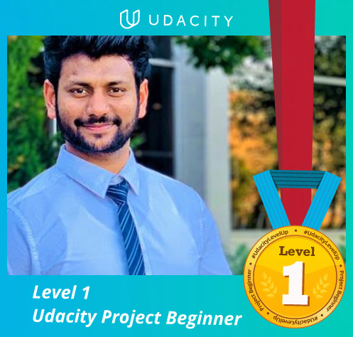

# Data-Engineer-Nano-Degree
Data Engineer Nano Degree - Udacity

|  |  |   |  | 
|:---:|:---:|:---:|:---:|
| Data Modeling with Postgres | Data Modeling with Apache Cassandra | Cloud Data Warehouses | Data Lakes with Spark |
